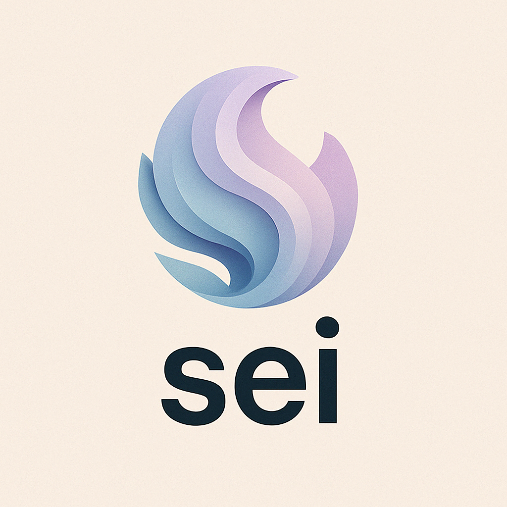

# Sei: A Magical AI Therapy Companion

<p align="center">
  
</p>

<p align="center">
  <em>Where AI meets empathy to create conversations that heal</em><br>
  <strong>Capstone Project for Google's 5-day Gen AI Intensive Course</strong>
</p>

## ✨ What is Sei?

Sei is an innovative AI therapy companion built with Google's Agent Development Kit (ADK) that creates warm, insightful conversations using a multi-agent architecture. Unlike regular chatbots or general-purpose LLMs, Sei is specifically designed to:

- 🌟 Create a genuinely warm, engaging therapeutic presence
- 🧠 Integrate multiple therapeutic perspectives (CBT, Psychoanalytic, Motivational, Faith-based)
- 💫 Remember your story across sessions with a sophisticated memory system
- 🚨 Detect crisis situations and provide appropriate resources
- 🙏 Respect faith preferences and integrate them thoughtfully when desired

Built with the Google Agent Development Kit (ADK) and Gemini 2.0 Flash, Sei represents a new vision for AI companionship—one that feels truly magical rather than mechanical.

## 🚀 Getting Started

### Prerequisites

- Python 3.9+
- Google Agent Development Kit (ADK)
- Access to Google Cloud (for Gemini API)

### 1. Set up Environment & Install ADK

**Create & Activate Virtual Environment (Recommended):**

```bash
# Create
python -m venv .venv

# Activate (each new terminal)
# macOS/Linux:
source .venv/bin/activate

# Windows CMD:
.venv\Scripts\activate.bat

# Windows PowerShell:
.venv\Scripts\Activate.ps1
```

**Install ADK:**

```bash
pip install google-adk
```

### 2. Clone and Install Sei

```bash
# Clone the repository
git clone https://github.com/yourusername/sei-therapy-agent.git
cd sei-therapy-agent

# Install dependencies
pip install -r requirements.txt
```

### 3. Set up Environment Variables

Create a `.env` file in the root directory:

```
GOOGLE_API_KEY=your_api_key_here
```

### 4. Run Sei

Using the ADK web interface (recommended for first-time users):

```bash
adk web
```

Then select "sei_therapist" from the dropdown in the web interface.

Using the command line:

```bash
adk run sei_therapist
```

## 🏗️ Architecture

Sei uses a sophisticated multi-agent architecture that creates a seamless, magical experience:


The system includes:

- **Root Agent (Sei)** - The main orchestration hub
- **Specialized Agents**:
  - **Onboarding Agent** - Creates a warm first-time experience
  - **Greeting Agent** - Handles session beginnings with continuity
  - **Therapeutic Agent** - Provides core therapeutic responses 
  - **Crisis Agent** - Detects and handles safety concerns
  - **Treatment Agent** - Creates personalized therapeutic plans
  - **Farewell Agent** - Closes sessions with meaningful summary

Behind the scenes, a parallel consultation system analyzes input from multiple therapeutic perspectives simultaneously:
- Cognitive Behavioral Therapy (CBT)
- Psychoanalytic approach
- Motivational perspective
- Faith-based integration (when appropriate)

## 🔍 Key Features

### Emotional Intelligence
Sei detects emotions and responds with appropriate warmth and insight.

### Magical Memory
Sei remembers your story—your job interview next week, your relationship struggles, how you felt last session—creating true continuity.

### Therapeutic Depth
Instead of generic advice, Sei offers thoughtful perspectives drawn from multiple therapeutic traditions.

### Faith Integration
For users who indicate faith is important, Sei can thoughtfully integrate spiritual perspectives.

### Crisis Detection
Sei automatically identifies safety concerns and provides appropriate resources.

### Therapeutic Boundaries
Unlike general LLMs, Sei can gently push back when necessary—just as a good therapist would.

### Seamless Experience
Despite its complex architecture, Sei presents as a single magical presence with a consistent voice.

## 🔧 Advanced Configuration

For deeper customization, you can modify configuration settings in `config/settings.py`:

```python
# Example configuration options
CRISIS_DETECTION_SENSITIVITY = "medium"  # Options: low, medium, high
FAITH_INTEGRATION_ENABLED = True
MEMORY_RETENTION_DAYS = 30
```

## 📚 Development Resources

- [Google ADK Documentation](https://github.com/google/agents-sdk)
- [Gemini API Documentation](https://ai.google.dev/docs)
- [Contributing Guidelines](CONTRIBUTING.md)

## 🔮 Future Directions

- **Emergency Contact Integration**: Notification system for crisis situations
- **Human Therapist Collaboration**: Pre-appointment summaries for therapists 
- **Vertex AI Vector Storage**: Enhanced memory using Google Cloud vector databases
- **Voice Interface**: Support for spoken conversations

## ⚠️ Limitations and Ethical Considerations

- Sei is not a replacement for professional mental health care
- For serious mental health concerns, please consult qualified professionals
- Sei is a research project and companion, not a medical device or service

## 🙏 Acknowledgments

- **Kaggle and Google**: For the Gen AI Intensive Course
- **Fernanda Uria**: For clinical psychology expertise
- **Solange Pardo**: For the session summarization concept
- **Marielle Morales**: For support throughout development

## 📄 License

This project is licensed under the Apache License 2.0 - see the [LICENSE](LICENSE) file for details.

---

*Created with ❤️ as a capstone project for Google's 5-day Gen AI Intensive Course*
